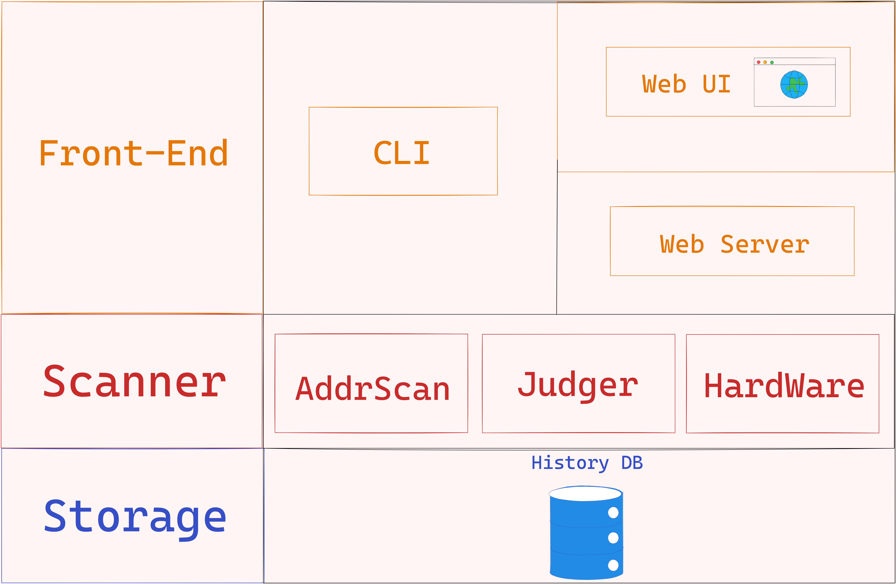
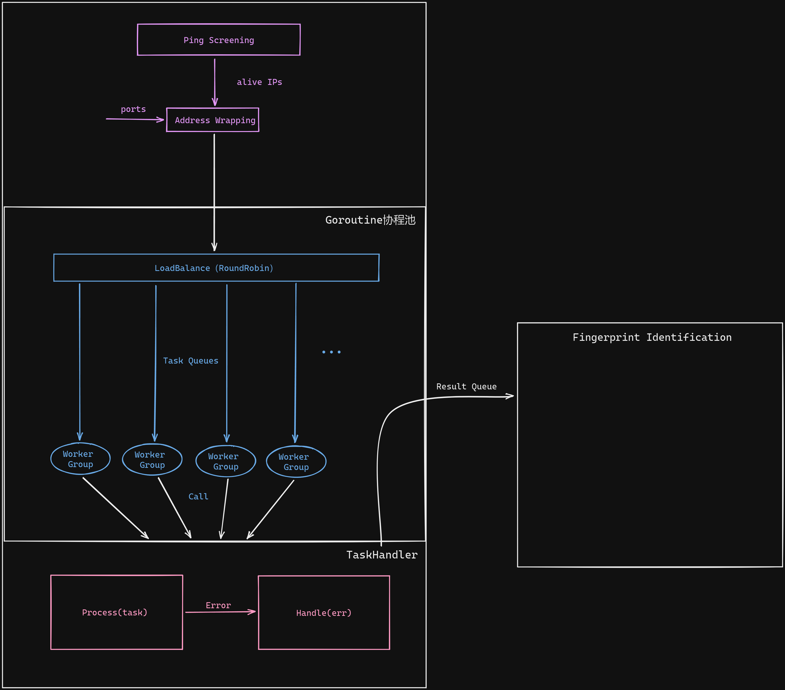
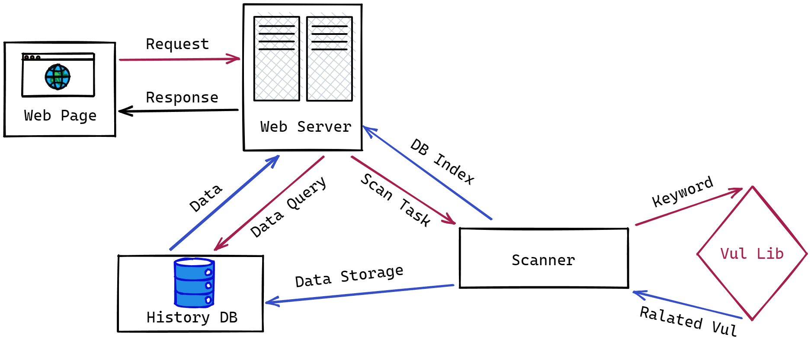

# FGV50
> jy, v50; hy, v50!  

## Project Architecture


## Modules


## Scanner Structure


## Web API


+ "/"
  + Method: **GET**
  + Param: null
+ "/hist"
  + Method: **POST**
  + ReqParam:
  
  ```json
    {
      "time": "2022-09-01 15:51:07"
    }
  ```
  + RespParam:
  
    同下
    
+ "/cmd"
  + Method: **POST**
  + ReqParam: 
  
  ```json
    {
      "cmd_type": "i",
      "url": "",
      "ip": "127.0.0.1",
      "port": 3306,
      "network_segment": ""
    }
  ```
  + RespParam:
  
  ```json
      {
        "msg": "ok",
        "data": {
          "time": "2022-09-01 15:51:07",
          "res": [
              {
                  "time": "2022-09-01 15:51:06",
                  "host": "127.0.0.1",
                  "port": 445,
                  "protocol": "smb",
                  "type": "tcp",
                  "idstring": "",
                  "banner": "Version:10.0.22000||DNSComputer:LAPTOP-FUN1PSMS||TargetName:LAPTOP-FUN1PSMS||NetbiosComputer:LAPTOP-FUN1PSMS"
              }
          ],
          "vul": [
            {
              "smb": [
                {
                  "cve_id": "AVD-2022-35804",
                  "vul_name": "SMB 客户端和服务器远程代码执行漏洞",
                  "vul_type": "未定义",
                  "cve_date": "2022-08-09",
                  "is_cve": "CVE-2022-35804",
                  "is_poc": "暂无可利用代码\""
                },
                {
                  "cve_id": "AVD-2022-32230",
                  "vul_name": "Windows SMB 拒绝服务漏洞",
                  "vul_type": "CWE-476",
                  "cve_date": "2022-06-14",
                  "is_cve": "CVE-2022-32230",
                  "is_poc": "暂无可利用代码\""
                }
              ]
            }
          ]
        }
      }   
  ```


## Build

Use the Makefile to Build the project.

```shell
$  make build 
``` 
The final executable file will be in the directory: `/out`

## Data Structure
+ 使用阻塞队列来构成协程池，以及扫描结果输出
+ json
+ leveldb
  
  